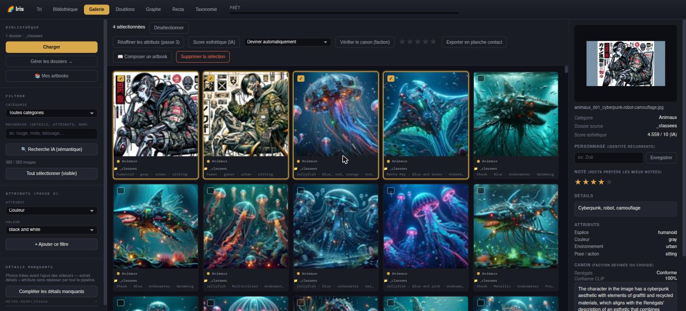
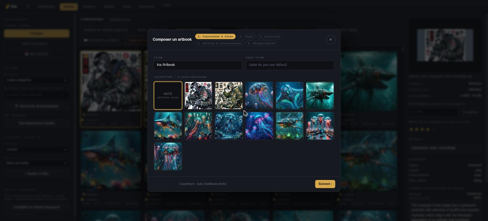
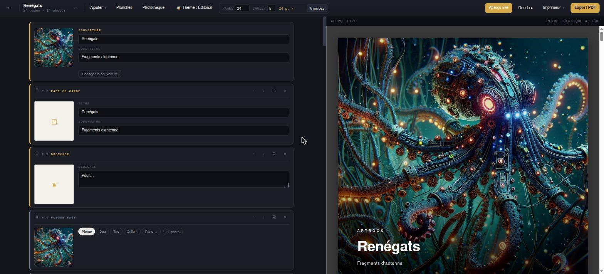
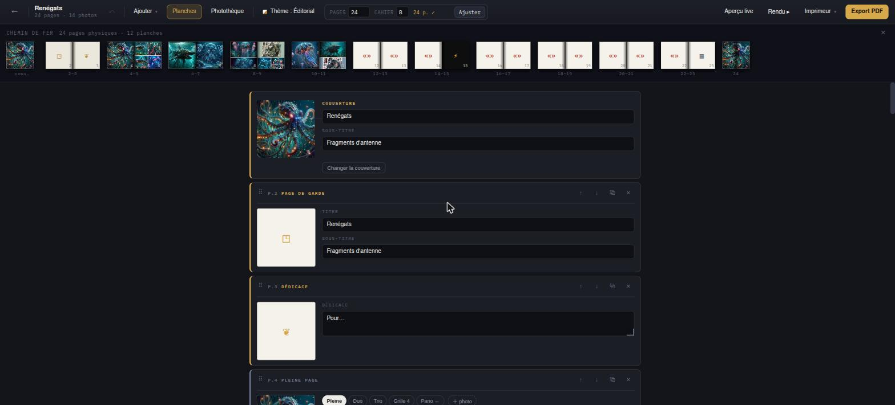
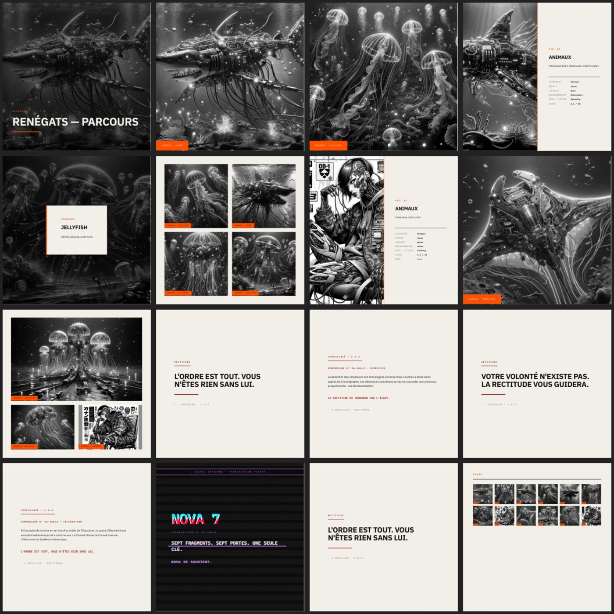
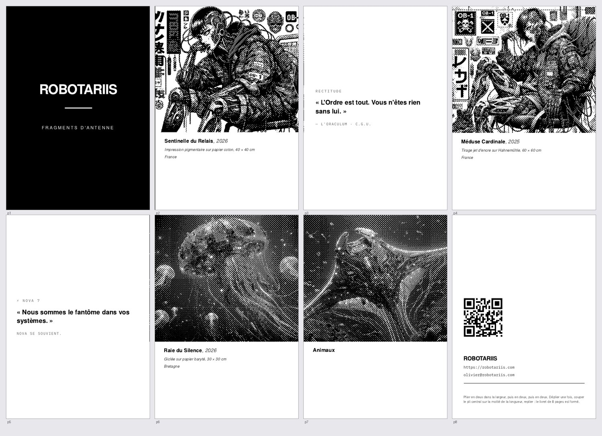
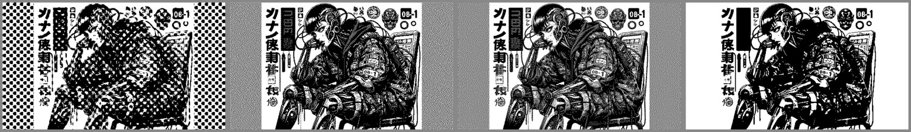
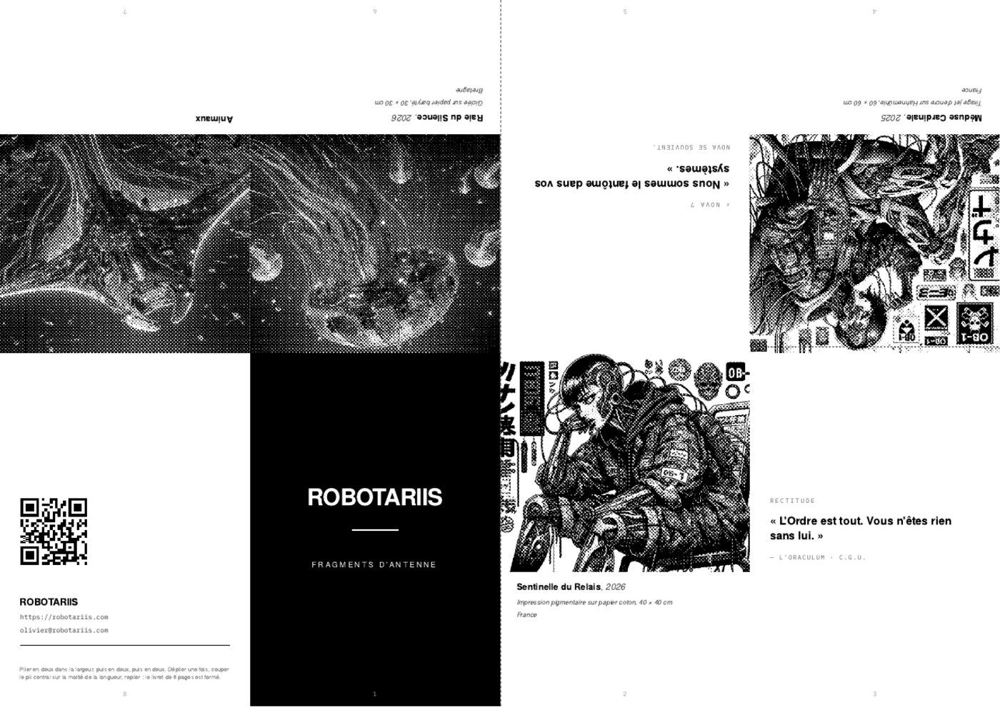
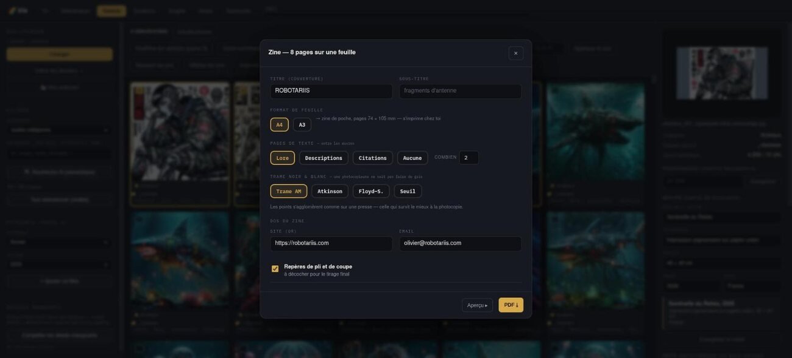

# 🌈 Iris

Application web locale de **tri, documentation et recherche d'images** par
contenu — et de **fabrication d'objets imprimés** : livres photo prêts pour
l'imprimeur, catalogues, et zines 8 pages sur une feuille pliée. Pensée
pour traiter de gros volumes rapidement sur GPU : calcul déporté sur la machine
GPU, affichage dans n'importe quel navigateur du réseau.

Interface façon table de montage : surface sombre, parce qu'un fond clair force
l'œil à comparer les photos à du blanc et fausse la lecture des tons.

Iris est la **documentaliste** : tri, recherche, attributs, mise en page. Elle
ne publie rien elle-même sur les réseaux — [Recta](https://github.com/obareau/Recta)
est le Posteur.



---

## Trier et documenter

### Pipeline (onglet Tri)

Trois passes cumulatives et indépendantes :

1. **Analyse** — classement par catégorie
   - **YOLOv8n** : pré-filtre rapide, résout les images à objet dominant.
   - **CLIP ViT-L/14** (zero-shot) : prend le relais sur les cas ambigus.
   - Détection **couleur** (N&B / Couleur) et **format** déterministe, sans IA.
2. **Détails** — mots-clés descriptifs via le VLM **Qwen2-VL-2B**, intégrés au
   nom de fichier.
3. **Affiner** — attributs structurés par catégorie (JSON), affichés dans
   l'inspecteur.

Les embeddings sont mis en cache (SQLite) : une image déjà analysée n'est jamais
recalculée. Un bouton « Tout faire d'un coup » enchaîne les trois passes.

### Les onglets

| Onglet | Ce qu'il fait |
|---|---|
| **Tri** | import d'un dossier, pipeline, application (déplace + renomme), undo |
| **Bibliothèque** | catalogue de dossiers vus comme une seule collection |
| **Galerie** | filtres, recherche sémantique CLIP texte→image, sélection en masse, lightbox |
| **Doublons** | regroupe les quasi-identiques, corbeille réversible |
| **Graphe** | similarité visuelle, ou même personnage récurrent (crop identité) |
| **Recta** | timeline des photos déjà publiées |
| **Taxonomie** | nuage de mots des attributs, clic → filtre la Galerie |

Sélection façon explorateur : clic, **Ctrl+clic**, **Maj+clic** pour une plage.

### Au-delà du tri

- **Score esthétique** — MLP sur embeddings CLIP (improved-aesthetic-predictor),
  score ~1-10 façon AVA, sans calcul supplémentaire.
- **Vérification de canon** — devine la faction d'un personnage (CLIP zero-shot
  sur les fiches du vault), puis Qwen2-VL lit l'image + le lore pour un verdict
  motivé. Premier tri consultatif, pas un jugement définitif.
- **EXIF write-back** — catégorie, détails, attributs, note, score écrits dans le
  JPEG lui-même (`XPComment`/`XPKeywords`).
- **Annulation** — tous les jobs longs ont un bouton Annuler.

### Rangement

```
Destination/Categorie/Couleur/Format/categorie_###_mots-cles.jpg
```

Chaque application écrit un journal permettant l'**annulation**. Un sidecar JSON
accompagne chaque photo classée : le classement voyage avec les fichiers.

---

## Composer un livre

Un module d'artbook complet : curation automatique, puis édition de A à Z.

### Le wizard

Sélection de photos → cinq étapes : couverture, style, structure, reliure,
récapitulatif.



La curation exploite les données déjà calculées par Iris — score esthétique pour
choisir les *hero shots*, catégories pour découper en chapitres, attributs pour
remplir les fiches techniques.

### L'éditeur

Chaque page affiche une **miniature carrée à la proportion réelle** dont la
grille reproduit le vrai gabarit, et porte une **tranche de couleur** disant ce
qu'elle est — photo, texte, liminaire, intercalaire. Le rythme du livre se lit au
défilement.

**Aperçu live** : le rendu serveur à côté des formulaires, rafraîchi à chaque
modification. Même moteur que le PDF, donc strictement identique au fichier
final.



Édition complète : glisser-déposer des pages et des photos, photothèque pour
piocher dans toute la bibliothèque, gabarit qui suit le nombre de photos
(1 → pleine page, 2 → duo, 3 → trio, 4 → grille), légendes, undo, duplication,
bascule de thème.

### Le chemin de fer

Un livre ne se juge pas page à page : la couverture est seule, puis les pages
vont **en vis-à-vis**. Le chemin de fer montre les planches avec l'ombre de
pliure ; un gabarit panoramique compte pour deux pages physiques et s'affiche en
deux moitiés, ce qui rend visible s'il tombe bien à cheval sur la reliure.



### Reliure et intercalaires

Le total de pages se cale sur un **multiple de 4, 8 ou 16** (une feuille pliée =
4 pages), avec une cible par défaut de 24 pages. Le complément est fait
d'intercalaires puisés dans le lore du projet — communiqués de propagande et
émissions pirates avec esthétique glitch.



### Export imprimeur

Trois destinations, parce qu'elles n'attendent pas le même fichier :

| Profil | Pour qui | Feuille | Couleur |
|---|---|---|---|
| **Blurb · Lulu** | livre photo en ligne | 216 mm | RVB |
| **Pixartprinting** | imprimeur pro | 216 mm | **CMJN Fogra 39** |
| **Atelier** | imprimeur classique | 226 mm | CMJN + traits de coupe |

216 mm = 210 de format fini + 3 mm de fond perdu de chaque côté. Les textes posés
sur une image respectent une zone tranquille de 12,7 mm.

**Le noir est traité correctement** : Chromium écrit le texte en noir RVB, qui
se sépare en noir riche (~300 % d'encre sur quatre plaques — frange de repérage
garantie sur du petit texte). Iris repasse tous les aplats neutres en DeviceGray
avant la séparation, pour que le noir tienne sur **la seule plaque noire**. Les
vraies couleurs ne sont pas touchées.

📄 Voir **[IMPRESSION.md](IMPRESSION.md)** — relevé des specs chez Pixartprinting,
Lulu, Blurb et CEWE, et la marche à suivre.

📄 Voir **[CATALOGUE.md](CATALOGUE.md)** — thème *Catalogue* (A4, liste de
fiches produit), import d'un catalogue `.odt` existant, édition/masquage des
prix en masse.

---

## Faire un zine

Un objet promo qui tient sur **une seule feuille** : pliée trois fois, une coupe
au pli central, et voilà un livret de 8 pages. Pas de reliure, pas de minimum de
commande, pas d'imprimeur — une feuille = un zine, tiré chez soi à l'unité.

Les 8 pages, dans l'ordre de lecture :



### Le tramage n'est pas un effet de style

Une photocopieuse, comme une laser, ne sait poser **que du noir ou rien**. Envoyer
une photo en niveaux de gris, c'est laisser le pilote décider : il applique une
trame quelconque et les demi-teintes partent en bouillie. Iris trame lui-même,
en 1 bit, avec quatre algorithmes et un usage pour chacun :



| Trame | Quand l'utiliser |
|---|---|
| **Clustered-dot (AM)** | **la photocopie** — les points s'agglomèrent comme sur une presse ; un amas survit là où des pixels isolés se bouchent ou disparaissent |
| **Atkinson** | ne diffuse que 6/8 de l'erreur : très contrasté, blancs francs, rendu MacPaint |
| **Floyd–Steinberg** | détail maximal, mais son bruit fin se bouche à la photocopie — à réserver au laser direct ou au risographe |
| **Seuil** | trait, logo, aplats — pas une photo |

### L'imposition

Pour qu'un livret plié se lise dans l'ordre, les pages doivent être disposées
dans un ordre précis sur la feuille, et **la rangée du haut imprimée à l'envers** :

```
Rangée haut (180°) :  p7  p6  p5  p4
Rangée bas   (0°)  :  p8  p1  p2  p3
                     (dos)(couv)
```



Iris produit **une seule page HTML** contenant la feuille entière, rangée du haut
retournée en CSS : aucun post-traitement du PDF, ce que rend le navigateur est
déjà la feuille à imprimer.

### Réglages



- **Format** : A4 (zine de poche, pages 74 × 105 mm) ou A3 (A6, 105 × 148 mm).
- **Pages de texte** au choix : lore canon, descriptions extraites par Iris,
  citations, ou aucune. Les œuvres portent leur cartel.
- **QR vectoriel** au dos (SVG, net à n'importe quelle taille) avec site et email
  — ce qui rend un objet papier mesurable.
- **Repères de pli et de coupe**, à décocher pour le tirage final.

---

## Ce qui vient d'ailleurs

Deux briques du zine ne sont pas nées ici — elles ont été **portées depuis des
projets voisins**, où elles avaient déjà fait leurs preuves :

- **[MONO°](https://github.com/obareau/mono)** — atelier d'image 1 bit, 42
  filtres, dont le README annonce lui-même « built for zines, risograph/offset
  prep ». Ses quatre trames (clustered-dot d'Ulichney, Atkinson,
  Floyd–Steinberg, seuil) sont portées en Python dans `backend/dither.py`.
- **[Recta](https://github.com/obareau/Recta)** — publie un zine de propagande
  chaque semaine depuis des mois. Sa table d'imposition « fringearts » est
  reprise dans `backend/zine.py`.

Portées, pas appelées : ce sont quelques dizaines de lignes de données et
d'algorithme. Une dépendance entre projets (Iris exécutant du TypeScript de
Recta) aurait coûté plus cher en fragilité que la copie ne coûte en duplication.
Les fichiers créditent leur source.

---

## MCP `iris`

Serveur MCP en **lecture seule** (`iris_mcp.py`, stdio) pour qu'un agent puisse
interroger la bibliothèque sans passer par l'UI : `iris_search`,
`iris_categories`, `iris_image_details`, `iris_similar_images`,
`iris_library_folders`. Aucune écriture exposée — notation, suppression et
publication restent dans l'UI, avec confirmation humaine.

```bash
claude mcp add iris -s user -- uv run --with mcp ~/DEV/iris/iris_mcp.py
```

---

## Installation

```bash
./setup.sh
```

Le script détecte le GPU (NVIDIA, AMD/ROCm ou aucun) et installe la roue
PyTorch correspondante — le code d'Iris, lui, est identique dans les trois cas.
Il vérifie aussi les binaires système nécessaires à l'export
(`ghostscript`, `poppler-utils`, un navigateur, `colord-data` pour le profil
Fogra 39) et dit quoi installer s'il en manque.

Forcer un mode : `./setup.sh --cuda` · `--rocm` · `--cpu`.

### Ou sans rien installer (Docker)

```bash
docker run -p 8800:8800 \
  -v ~/Photos:/photos \
  -v iris-models:/root/.cache/huggingface \
  -v iris-data:/app/data \
  ghcr.io/obareau/iris
```

L'image est **CPU** : fonctionnelle partout, mais lente. Une image ne peut pas
embarquer les trois roues PyTorch (CUDA, ROCm, CPU) — il en faudrait trois, de 6
à 10 Go chacune. Qui a un GPU a une machine équipée et lance `./setup.sh`, qui
gère les trois cas.

Le volume sur le cache HuggingFace évite de re-télécharger les ~10 Go de modèles
à chaque conteneur.

Sans GPU, Iris bascule sur le processeur : fonctionnel, mais lent. Les modèles
(~10 Go) se téléchargent au premier usage.

📄 Voir **[PORTAGE.md](PORTAGE.md)** — dépendances détaillées, install ROCm,
pièges connus, données à emporter.

## Lancement

```bash
./run.sh          # uvicorn sur 0.0.0.0:8800
```

Puis ouvrir `http://<ip-machine>:8800`. Un fichier `iris.service` (systemd) est
fourni pour un démarrage automatique.

---

## Pile technique

FastAPI · PyTorch · open_clip (ViT-L/14) · Ultralytics YOLO · Transformers
(Qwen2-VL-2B) · SQLite · piexif · pikepdf + Ghostscript (prépresse) · segno (QR) ·
HTML/CSS/JS vanilla, sans build.

Voir `ROADMAP.md` pour la suite et `CHANGELOG.md` pour l'historique.

---

Les images des captures d'écran sont des visuels du projet
[Robotariis](https://robotariis.com), l'univers pour lequel Iris a été écrit.
